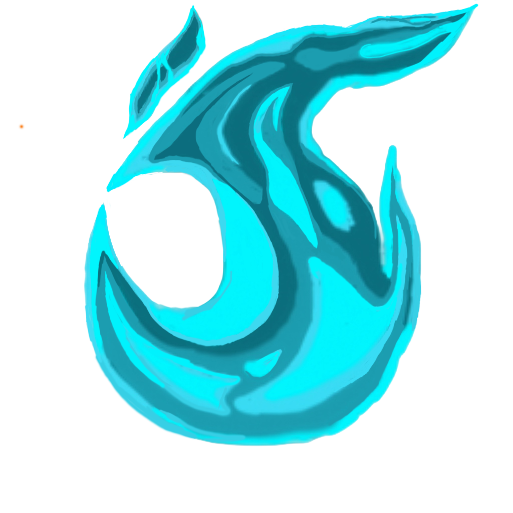

# Multiplayer Edit



Real-time collaborative level editing for Geometry Dash! Host a session, invite your friends with a room code, and build levels together in real-time.

## Features

- **Real-Time Collaborative Editing:** Host a session, share the room code, and build together.
- **Instant Synchronization:** Placement, deletion, rotation, scaling, and movement are updated across all connected clients.
- **Isolated Undo/Redo Stacks:** Action history is tracked per player, meaning your undo/redo actions won't overwrite other players' actions.
- **Player Cursors & Badges:** Track player movements live in the editor. Badges display next to player cursors showing the specific object they currently have selected.
- **Playtesting icon Sync:** Watch players playtest in the editor.
- **Smart Object Locking:** Automatically locks selected objects to prevent multiple players from editing the same objects, ensuring no race conditions or crashes.
- **Session HUD & Player List:** Keep track of room details with a player list and status overlay showing the active session code.
- **Join/Leave Notifications:** In-game notifications alert you when players enter or leave the room.

## [Join the Official Discord Server!](https://discord.gg/mdsuxYu2YP)

## How to Use

### Installation

1. Make sure you have [Geode](https://geode-sdk.org/) installed.
2. Go to the [Releases page](https://github.com/xXoanon/MultiplayerEdit/releases) and download the latest `.geode` file.
3. Place the `.geode` file in your Geometry Dash `geode/mods/` folder.
4. Restart Geometry Dash.

### Using the Mod

1. Open any level in the Geometry Dash level editor.
2. Click the **Multiplayer** button in the editor pause menu if hosting, or on the "My Levels" page if joining.
3. Click **Host** to create a session and share the room code, or click **Join** and enter your friend's room code, or join through the public room browser.
4. Once connected, your changes will sync automatically!

## Build Instructions

To build the mod from source, you will need the [Geode SDK and CLI](https://docs.geode-sdk.org/) installed.

```sh
# Clone the repository
git clone https://github.com/xXoanon/MultiplayerEdit.git
cd MultiplayerEdit

# Build the mod for the default platform
geode build
```

To build targeting specific platforms (e.g. Android or Windows cross-compilation on Linux):
```sh
# Windows (on Linux)
geode build --platform win

# Android (64-bit)
geode build --platform android64
```

## Running the Signaling Server

The mod establishes direct Peer-to-Peer (P2P) connections between players using WebRTC. However, it requires a lightweight signaling server to exchange initial connection information to matchmake players. A public default signaling server is configured by default (`https://dewy-flea-9364.d050.deno.net`), but you can host your own.

See the [server/README.md](server/README.md) file for setup and hosting instructions. You can update the **Signaling Server URL** setting in the mod settings in-game to connect to your custom server.

> **Note**: It is not recommended to use the old NodeJS WebSocket relay server (version 0.3.0 and older). Those older versions are much buggier and less stable compared to the newer P2P WebRTC releases.

## Support Development

If you enjoy this mod or any of my other projects, consider supporting future development on [Patreon](https://www.patreon.com/c/d050/membership)!
